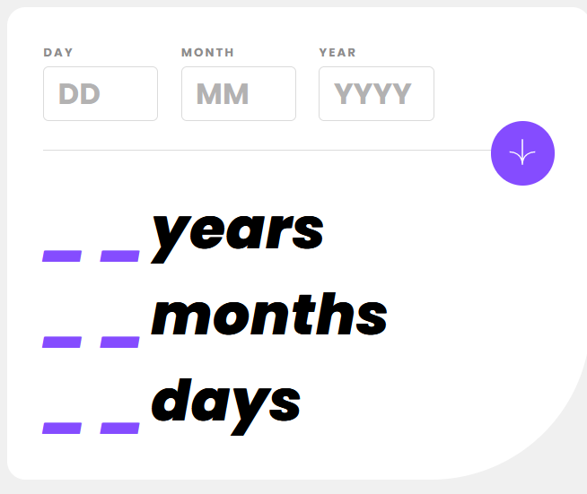
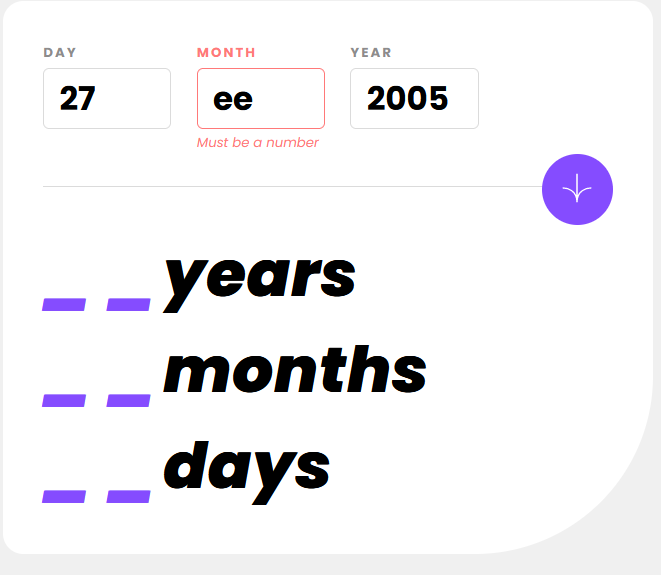

# Frontend Mentor - Age calculator app solution

This is a solution to the [Age calculator app challenge on Frontend Mentor](https://www.frontendmentor.io/challenges/age-calculator-app-dF9DFFpj-Q). Frontend Mentor challenges help you improve your coding skills by building realistic projects. 

## Table of contents

- [Overview](#overview)
  - [The challenge](#the-challenge)
  - [Screenshot](#screenshot)
  - [Links](#links)
- [My process](#my-process)
  - [Built with](#built-with)
  - [What I learned](#what-i-learned)
  - [Continued development](#continued-development)
  - [Useful resources](#useful-resources)
- [Author](#author)
- [Acknowledgments](#acknowledgments)

## Overview

### The challenge

Users should be able to:

- View an age in years, months, and days after submitting a valid date through the form
- Receive validation errors if:
  - Any field is empty when the form is submitted
  - The day number is not between 1-31
  - The month number is not between 1-12
  - The year is in the future
  - The date is invalid e.g. 31/04/1991 (there are 30 days in April)
- View the optimal layout for the interface depending on their device's screen size
- See hover and focus states for all interactive elements on the page
- **Bonus**: See the age numbers animate to their final number when the form is submitted

### Screenshot






### Links

- Solution URL: [Add solution URL here](https://your-solution-url.com)
- Live Site URL: [Add live site URL here](https://your-live-site-url.com)

## My process

### Built with

- CSS custom properties
- Flexbox
- Mobile-first workflow
- [NixixJS](https://github.com/michTheBrandofficial/NixixJS) - for templating and embedding fully reactive data. 

### What I learned

 - Switch statements work well when mutiple conditionals return the same value.
```javascript
  switch (false) {
    case checkEmpty({month, day, year}, values):
    case checkNan({month, day, year}):
    case validateDate({month, day, year}):
      return fallback;
  }
```

  instead of 

```javascript
  if (checkEmpty({month, day, year}, values) === false) return fallback;
  if (checkNan({month, day, year}) === false) return fallback;
  if (validateDate({month, day, year}) === false) return fallback;
```

### Continued development
 
 - Recently learned that Dates are tricky in JavaScript. Will work on Javascript date formatting. 
 - Will also work on writing less CSS and composing styling errors like invalid input fields better.

### Useful resources

- [Mystery Code's Age Calculator App](https://www.youtube.com/@MysteryCode) - This helped me to understand how to format Dates to get the exact number of years, months and days. Really useful 👍. 

## Author

- Frontend Mentor - [michTheBrandofficial](https://frontendmentor.io/profile/michTheBrandofficial)
- DEV.to - [michthebrandofficial](https://dev.to/michthebrandofficial)
- Github - [michTheBrandofficial](https://github.com/michTheBrandofficial)

## Acknowledgments

- I want to thank Mystery Code's Youtube Channel for the Age-Calculator app using JS, HTML and CSS. [Link](https://www.youtube.com/@MysteryCode)
- I also want to thank Frontend Mentor for posting this challenge. Really pushed me to learn something new. 
